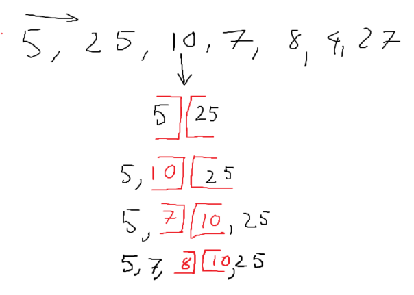

# Intuition

- A key insight for this problem is that the median is the middle value of the stream, so if we can somehow **split the stream at the middle** we can easily find the median.
- We know that the array wont be sorted, but the median should always stay at the middle point of the sorted stream/array. Combine with the above insight, the median will **either stay at the top left of bottom right** of the array.
- We dont need to sort the array everytime, instead if we splitted the array right at the median point/s, we can compare the new value with **current median candidates**.

- Let's consider the following testcase: input = [5,25,10,7,8,4,27]
  - We see that at the third insertion of 10, it go between 5 and 25, let's insert it into the left side of the "wall".
  - At the fourth insertion of 7, it go between 10 and 25, this time we don't need to consider 5, as median is either 7 or 10.
  - Keep going and we will see that all the **red-indicated** value is either **the biggest or smallest of its side**. What can we infer from this observation?



# Approach 

## Heap as a bucket

- We can see that in a supposedly-sorted-array, the median value is the biggest value in its the left half and is the smallest in the right half. So if we use 2 heap as a bucket to split the stream/array, we can easily get the median value/s.
- With a newly inserted value, we only need to check if it belong in the left side or right side of the array. After correctly add it into its correct bucket(heap), we need to compare the size of 2 buckets to readjust for the correct median. We can easily do this at every insertion.
- In the following implementation, I implemented the solution to be left-biased, which mean the median will always be at the left side **odd-length stream**.

## Complexity

- Time complexity: $O(\log n)$ The median will always be at the top node of either heap (left in this implementation) and both in even-length data stream
- Space complexity: $O(n)$ The combined size of both heaps is equal the size of input stream

## Code

```cpp
class MedianFinder {
public:
    priority_queue<int> big_heap; // left haft of the stream, top node is biggest of left side -> median
    priority_queue<int, vector<int>, greater<int> > small_heap; // right half of the stream, top node is smallest of right side -> median

    MedianFinder() {}
    
    void addNum(int num) {
        if(big_heap.empty() || num <= big_heap.top()) big_heap.emplace(num);
        else small_heap.emplace(num);

        if(big_heap.size() > small_heap.size() +1) {
            small_heap.emplace(big_heap.top());
            big_heap.pop();
            return;
        }
        if(small_heap.size() > big_heap.size()) {
            big_heap.emplace(small_heap.top());
            small_heap.pop();
        }
    }

    double findMedian() {
        int m = big_heap.size(), n = small_heap.size();
        if(m > n) return big_heap.top();
        return (double) (big_heap.top()+small_heap.top())/2;
    }
};
```
