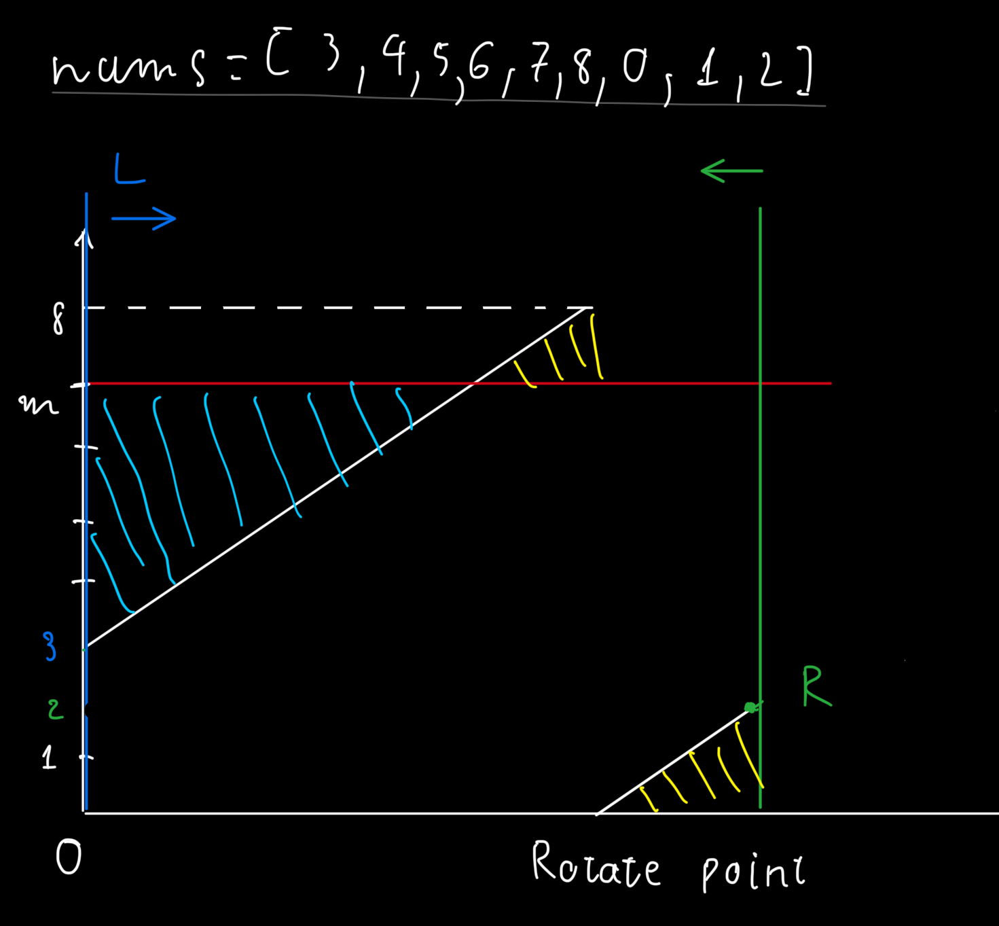

# Intuition

This is a modified version of a binary search problem, doing this is highly recommended to get better at implementing the binary search.

<p>&nbsp;</p>

# Approach: Binary search

- A key insight for this problem is that we need to visualize the rotated arrays into a graph, which will helps us implement the conditions for shinking the search space.

- Following the above image, you can imagine that there are 2 points of interest: the rotating point and the mid point (indicated by the red line). The rotating point will split our input array nums into 2 sorted array, so if you can somehow find out this point, you can easily run binary search for either half to find the target index.
- What about the mid point? We can see from the image that if we only rely on the mid point, there will be cases that target can lies on either the half of the array (in this case it is `target <= mid`). So relying only on mid will not suffice. But there are still a few key insights:
    - The array can either be right-bias (the rotate point is more to the right like the image), left bias, balanced or not roated at all. But lets assume the array will always be rotated, we can still easily reduce the conditions as follow:
    - If `left <= mid` then the array is right-bias (like the example image) [left, mid] will be a sorted array:
        - If target is inside [left, mid] then we can just shrink the right part (move green line to left).
        - If target is outside [left, mid], then we can safely move left index to mid.
    - If `mid < left` then we know that the array is left-bias, in this case, the we just need to reverse the condition:
        - The part [mid; right] is a sorted array, so if `target > mid` and `target <= r`, we can just shrink to right.
        - Else we shrink to left.

## Complexity
- Time complexity: $O(logn)$
- Space complexity: $O(1)$

## Code 

```cpp
class Solution {
public:
    int search(vector<int>& nums, int target) {
        int n = nums.size();
        int left = 0, right = n-1;
        while(left <= right) {
            int mid = left + (right-left)/2;
            int l = nums[left], r = nums[right], m = nums[mid];
            if(target == m) return mid;
            if(m >= l) {
                if(target >= l && target < m) {
                    right = mid-1;
                    continue;
                }
                left = mid+1;
                continue;
            }

            if (target > m && target <= r) 
                left = mid + 1;
            else 
                right = mid - 1;
        }
        return -1;
    }
};
```